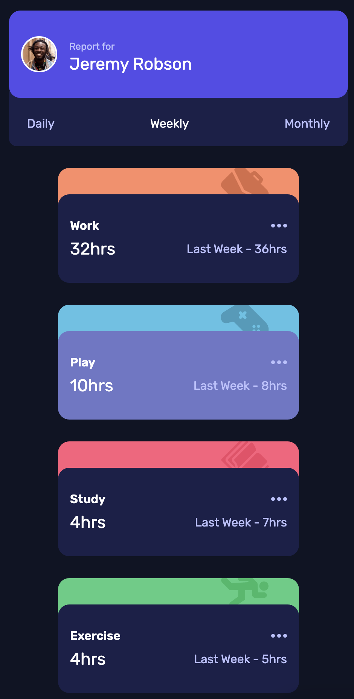
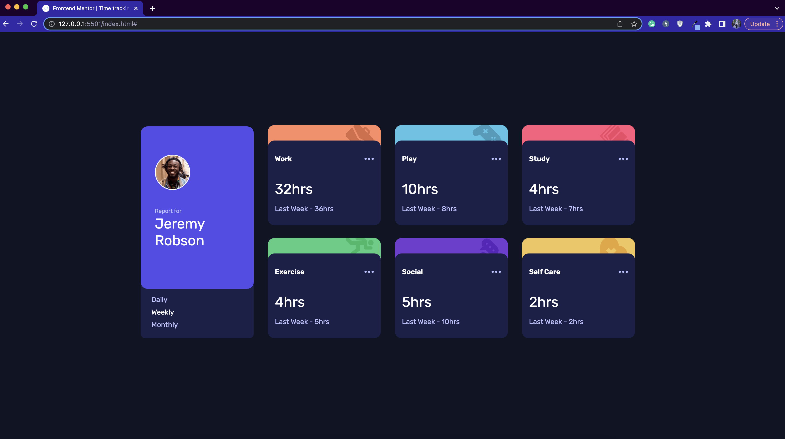

# Quiz 2 - Time tracking dashboard solution

This is a solution to the [Time tracking dashboard Quiz 2 challenge]

## Table of contents

- [Overview](#overview)
  - [The challenge](#the-challenge)
  - [Screenshot](#screenshot)
  - [Links](#links)
- [My process](#my-process)
  - [Built with](#built-with)
  - [What I learned](#what-i-learned)
  - [Continued development](#continued-development)
  - [Useful resources](#useful-resources)
- [Author](#author)
- [Acknowledgments](#acknowledgments)

## Overview

### The challenge

Users should be able to:

- View the optimal layout for the site depending on their device's screen size
- See hover states for all interactive elements on the page
- Switch between viewing Daily, Weekly, and Monthly stats

### Screenshot
- Mobile Layout

- Desktop Layout

### Links

- Solution URL: [https://github.com/Jeffrey9427/time-tracking-dashboard-main](https://github.com/Jeffrey9427/time-tracking-dashboard-main)
- Live Website URL: [https://jeffrey9427.github.io/time-tracking-dashboard-main/](https://jeffrey9427.github.io/time-tracking-dashboard-main/)

## My process

### Built with

- HTML
- CSS Flexbox and Grid
- JS

### What I learned

From this challenge, I learned how to make an interactive and responsive website using HTML, CSS and Javascript. I also learned how to fetch data from json and utilize it into our website.

### Continued development

I would like to keep practicing my coding skills as I know that there is still a lot of things that I haven't familiar with. 

### Useful resources

- Youtube

## Your Detail 

- Full Name - Jeffrey
- StudentID - 2602118484
- BINUS Email - jeffrey005@binus.ac.id
